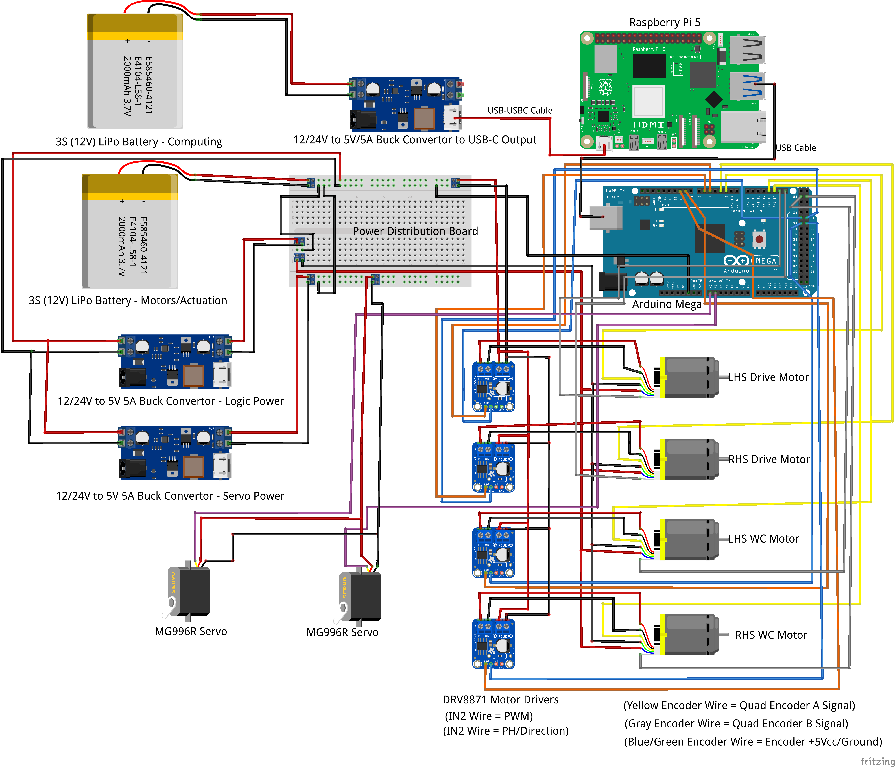

# Autonomous Pet Waste Collection Robot (APWCR) Software Repository

This repository contains the complete software stack for the **Autonomous Pet Waste Collection Robot (APWCR)** senior design project. The codebase supports computer vision model training, robot runtime execution, and isolated subsystem testing.

The repository is intentionally structured to separate **training**, **deployment**, and **testing**, following best practices for robotics, embedded systems, and collaborative software development.

---

## Electrical Component and Wiring Layout


---

## Repository Structure
```
APWCR_Software/
├── cv_training/
├── images/
├── robot/
├── test/
└── README.md
```

---

## Top-Level Folder Overview

### `cv_training/`
Contains **computer vision model training artifacts**.

- Jupyter notebooks used to train a YOLO-based pet waste detection model  
- Training performed using Google Colab with GPU acceleration  
- Large datasets and training outputs are intentionally excluded  

**Purpose:**  
Documentation and reproducibility of the machine learning workflow.  
This code is **not executed on the robot**.

---

### `images/`
Contains images used for documentation and reporting.

- Wiring diagrams  
- Architecture visuals  
- Figures referenced in reports and READMEs  

**Purpose:**  
Documentation and visual reference only.

---

### `robot/`
Contains **all software required to run the robot**.

#### `robot/python/`
High-level autonomy code executed on the Raspberry Pi or development laptop.

Includes:
- Computer vision inference  
- State machine and decision logic  
- Motion command generation  
- Communication with the Arduino  

See `robot/python/README.md` for detailed setup and execution instructions.

#### `robot/arduino/`
Low-level embedded firmware running on the Arduino.

Includes:
- Motor control  
- Actuator sequencing  
- Sensor handling  
- Serial command parsing  

#### `robot/cv_model/`
Trained YOLO model weights used for runtime inference.

#### `robot/config/`
YAML configuration files containing all tunable robot parameters.

Includes:
- Camera settings  
- Detection thresholds  
- Control parameters  
- Hardware configuration (e.g. serial port, baud rate)  

---

### `test/`
Contains **isolated testing and development scripts**.

- Used for subsystem-level testing (e.g. camera input, vision pipeline)  
- Allows rapid experimentation without modifying deployed robot code  
- Reuses configuration files from `robot/` to ensure consistency  

**Purpose:**  
Safe development, debugging, and experimentation.

---

## Design Philosophy
- Clear separation between **training**, **runtime**, and **testing**  
- Centralized configuration using YAML  
- Platform-agnostic file paths  
- Architecture designed to remain compatible with ROS if required in the future  

---

## Getting Started

### Prerequisites
- Git  
- Python 3.10 or newer  

### Installing Git
- **Windows:** https://git-scm.com/download/win  
- **macOS:** Xcode Command Line Tools or Homebrew  
- **Linux:** Install via your distribution’s package manager  

Verify installation:
```bash
git --version
```

---

## Cloning the Repository

Navigate to the directory where you want the project stored, then run:

```bash
git clone <REPO_URL>
cd APWCR_Software
```

After cloning, follow the setup instructions located in:

```
robot/python/README.md
```

---

## Notes
- Large datasets and trained artifacts are excluded by design  
- Runtime instructions are intentionally kept out of this README  
- Development should always reference the Python README for execution details  
